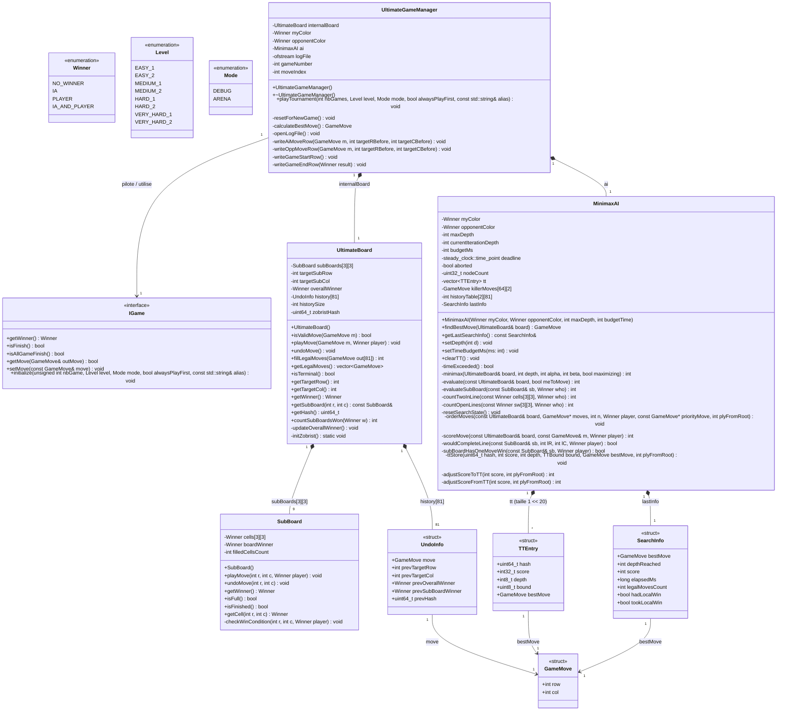

```mermaid
classDiagram
    direction TOP_BOTTOM

    class Winner {
        <<enumeration>>
        NO_WINNER
        IA
        PLAYER
        IA_AND_PLAYER
    }

    class Level {
        <<enumeration>>
        EASY_1
        EASY_2
        MEDIUM_1
        MEDIUM_2
        HARD_1
        HARD_2
        VERY_HARD_1
        VERY_HARD_2
    }

    class Mode {
        <<enumeration>>
        DEBUG
        ARENA
    }

    class GameMove {
        <<struct>>
        +int row
        +int col
    }

    class IGame {
        <<interface>>
        +getWinner() Winner
        +isFinish() bool
        +isAllGameFinish() bool
        +getMove(GameMove& outMove) bool
        +setMove(const GameMove& move) void
        +initialize(unsigned int nbGame, Level level, Mode mode, bool alwaysPlayFirst, const std::string& alias) void
    }

    class SubBoard {
        -Winner cells[3][3]
        -Winner boardWinner
        -int filledCellsCount
        +SubBoard()
        +playMove(int r, int c, Winner player) void
        +undoMove(int r, int c) void
        +getWinner() Winner
        +isFull() bool
        +isFinished() bool
        +getCell(int r, int c) Winner
        -checkWinCondition(int r, int c, Winner player) void
    }

    class UndoInfo {
        <<struct>>
        +GameMove move
        +int prevTargetRow
        +int prevTargetCol
        +Winner prevOverallWinner
        +Winner prevSubBoardWinner
        +uint64_t prevHash
    }

    class UltimateBoard {
        -SubBoard subBoards[3][3]
        -int targetSubRow
        -int targetSubCol
        -Winner overallWinner
        -UndoInfo history[81]
        -int historySize
        -uint64_t zobristHash
        +UltimateBoard()
        +isValidMove(GameMove m) bool
        +playMove(GameMove m, Winner player) void
        +undoMove() void
        +fillLegalMoves(GameMove out[81]) int
        +getLegalMoves() vector~GameMove~
        +isTerminal() bool
        +getTargetRow() int
        +getTargetCol() int
        +getWinner() Winner
        +getSubBoard(int r, int c) const SubBoard&
        +getHash() uint64_t
        +countSubBoardsWon(Winner w) int
        -updateOverallWinner() void
        -initZobrist() static void
    }

    class SearchInfo {
        <<struct>>
        +GameMove bestMove
        +int depthReached
        +int score
        +long elapsedMs
        +int legalMovesCount
        +bool hadLocalWin
        +bool tookLocalWin
    }

    class TTEntry {
        <<struct>>
        +uint64_t hash
        +int32_t score
        +int8_t depth
        +uint8_t bound
        +GameMove bestMove
    }

    class MinimaxAI {
        -Winner myColor
        -Winner opponentColor
        -int maxDepth
        -int currentIterationDepth
        -int budgetMs
        -steady_clock::time_point deadline
        -bool aborted
        -uint32_t nodeCount
        -vector~TTEntry~ tt
        -GameMove killerMoves[64][2]
        -int historyTable[2][81]
        -SearchInfo lastInfo
        +MinimaxAI(Winner myColor, Winner opponentColor, int maxDepth, int budgetTime)
        +findBestMove(UltimateBoard& board) GameMove
        +getLastSearchInfo() const SearchInfo&
        +setDepth(int d) void
        +setTimeBudgetMs(ms: int) void
        +clearTT() void
        -timeExceeded() bool
        -minimax(UltimateBoard& board, int depth, int alpha, int beta, bool maximizing) int
        -evaluate(const UltimateBoard& board, bool meToMove) int
        -evaluateSubBoard(const SubBoard& sb, Winner who) int
        -countTwoInLine(const Winner cells[3][3], Winner who) int
        -countOpenLines(const Winner sw[3][3], Winner who) int
        -resetSearchState() void
        -orderMoves(const UltimateBoard& board, GameMove* moves, int n, Winner player, const GameMove* priorityMove, int plyFromRoot) void
        -scoreMove(const UltimateBoard& board, const GameMove& m, Winner player) int
        -wouldCompleteLine(const SubBoard& sb, int lR, int lC, Winner player) bool
        -subBoardHasOneMoveWin(const SubBoard& sb, Winner player) bool
        -ttStore(uint64_t hash, int score, int depth, TTBound bound, GameMove bestMove, int plyFromRoot) void
        -adjustScoreToTT(int score, int plyFromRoot) int
        -adjustScoreFromTT(int score, int plyFromRoot) int
    }

    class UltimateGameManager {
        -UltimateBoard internalBoard
        -Winner myColor
        -Winner opponentColor
        -MinimaxAI ai
        -ofstream logFile
        -int gameNumber
        -int moveIndex
        +UltimateGameManager()
        +~UltimateGameManager()
        +playTournament(int nbGames, Level level, Mode mode, bool alwaysPlayFirst, const std::string& alias) void
        -resetForNewGame() void
        -calculateBestMove() GameMove
        -openLogFile() void
        -writeAiMoveRow(GameMove m, int targetRBefore, int targetCBefore) void
        -writeOppMoveRow(GameMove m, int targetRBefore, int targetCBefore) void
        -writeGameStartRow() void
        -writeGameEndRow(Winner result) void
    }

    %% Relations UML avec cardinalités explicites
    UltimateGameManager "1" *-- "1" UltimateBoard : internalBoard
    UltimateGameManager "1" *-- "1" MinimaxAI : ai
    UltimateGameManager "1" --> "1" IGame : pilote / utilise
    
    UltimateBoard "1" *-- "9" SubBoard : subBoards[3][3]
    UltimateBoard "1" *-- "81" UndoInfo : history[81]

    MinimaxAI "1" *-- "1" SearchInfo : lastInfo
    MinimaxAI "1" *-- "*" TTEntry : tt (taille 1 << 20)

    UndoInfo "1" --> "1" GameMove : move
    TTEntry "1" --> "1" GameMove : bestMove
    SearchInfo "1" --> "1" GameMove : bestMove

```
